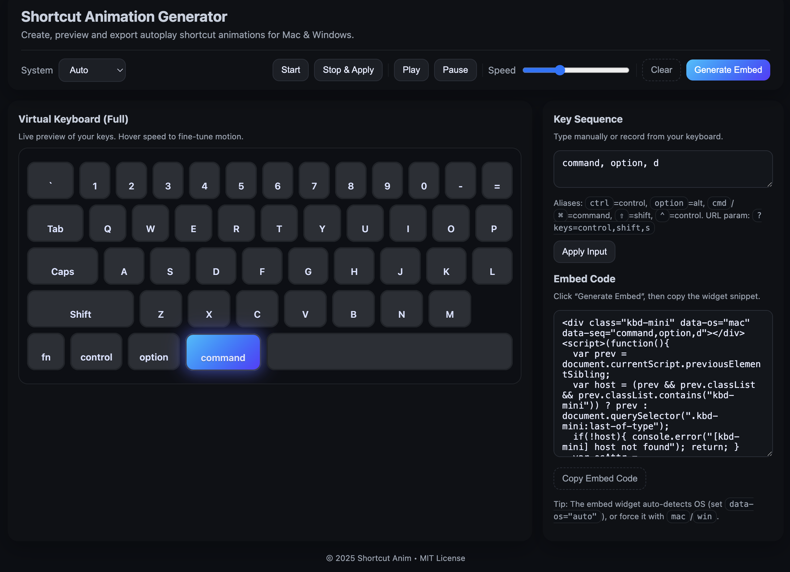

# Shortcut Animation Generator

A lightweight keyboard shortcut animation generator and embeddable widget.

## Preview


## Features
- Virtual keyboard renderer for Mac and Windows layouts
- Record key sequences or manually input them
- Generates autoplay shortcut animations
- Export as embeddable widget (HTML snippet)
- **Auto OS detection** - Automatically detects Mac/Windows and shows the correct keyboard layout
- **State persistence** - Saves minimize/expand state to localStorage (v0.2.0+)
- OS adaptive (Mac / Windows / Linux)

## Usage

### Basic Usage

You can use the prebuilt embed widget via CDN:

```html
<link rel="stylesheet" href="https://cdn.jsdelivr.net/gh/JoeyXi/shortcut-anim@v0.2.0/dist/kbd-mini.css">
<script src="https://cdn.jsdelivr.net/gh/JoeyXi/shortcut-anim@v0.2.0/dist/kbd-mini.js"></script>
<div class="kbd-mini" data-os="auto" data-seq="control,shift,s"></div>
```

### Auto OS Detection

Set `data-os="auto"` to automatically detect the user's operating system:

```html
<div class="kbd-mini" data-os="auto" data-seq="control,shift,s"></div>
```

The widget will automatically show:
- **Mac layout**: ⌘ command, ⌃ control, ⌥ option
- **Windows layout**: Ctrl, Win, Alt

### With State Persistence (v0.2.0+)

Use the enhanced generator (`apps/generator/index-with-storage.html`) to generate embed code with localStorage support. The widget will remember the minimize/expand state across page reloads.

## Development

Clone and run locally:

```bash
git clone https://github.com/JoeyXi/shortcut-anim.git
cd shortcut-anim
open apps/generator/index.html
```

### Generator Versions

- **Standard Generator**: `apps/generator/index.html` - Basic generator
- **Enhanced Generator**: `apps/generator/index-with-storage.html` - Includes localStorage support and auto OS detection

### Examples

- `examples/embed-autoplay.html` - Basic autoplay example
- `examples/embed-manual.html` - Manual mount example
- `examples/embed-with-storage.html` - Example with localStorage and auto OS detection

## Changelog

### v0.2.0
- ✨ Added localStorage support for saving minimize/expand state
- ✨ Added automatic OS detection (`data-os="auto"`)
- ✨ Enhanced generator with state persistence features
- 🔧 Improved OS detection logic (supports Mac, Windows, Linux)

### v0.1.0
- Initial release
- Basic keyboard animation generator
- Mac and Windows keyboard layouts

## License
MIT
